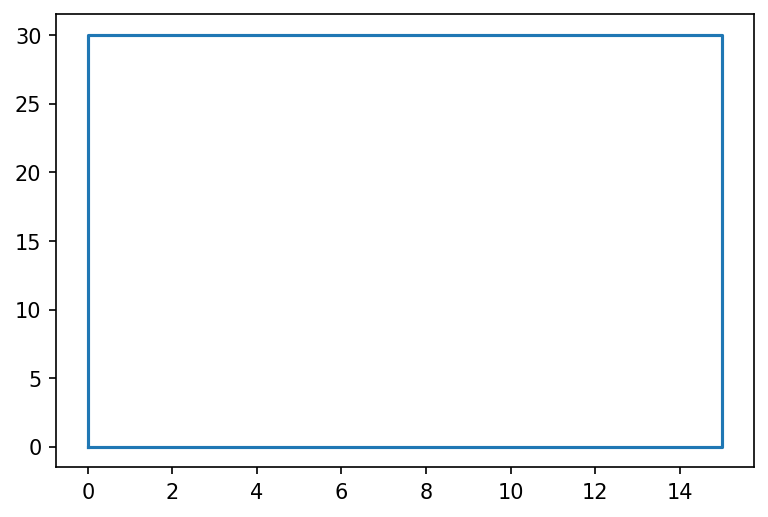

# Inserindo as coordenadas dos vértices de um polígono regular 


```python
import matplotlib.pyplot as plt # Biblioteca para plotagem de gráficos gerado pela inserção de coordenadas cartesianas
import numpy as np

# Para manter a coerência matemática do algoritmo, adicionamos uma unidade ao valor do número de vértices 'n_vert'
n_vert = int(input('Insira o número de vértices do polígono\nOBS: O último vértice deve ser sempre igual ao primeiro  >> ')) + 1
vertices = []
xvert = []
yvert = []

i = 0
print('\nInsira os vértices do seu polígono')

for i in range(0, n_vert):
    vertices_novos = [float(input('x_{} = '.format(i))), float(input('y_{} = '.format(i)))]
    vertices.append(vertices_novos)
    xvert_novos = vertices[i][0]
    xvert.append(xvert_novos)
    yvert_novos = vertices[i][1]
    yvert.append(yvert_novos)
print('\n')
```

    Insira o número de vértices do polígono
    OBS: O último vértice deve ser sempre igual ao primeiro  >> 4
    
    Insira os vértices do seu polígono
    x_0 = 0
    y_0 = 0
    x_1 = 15
    y_1 = 0
    x_2 = 15
    y_2 = 30
    x_3 = 0
    y_3 = 30
    x_4 = 0
    y_4 = 0
    
    
    

# Imprimindo o conjunto de pontos e gerando o polígono


```python
plt.figure(dpi=150) # Configurando a resolução do gráfico
plt.plot(xvert,yvert) # Configurando o eixo x e y do gráfico
plt.savefig("teste5.png") # Configurando a imagem a ser salva, assim como sua resolução
plt.show()
```


    

    


# Cálculo das propriedades geométricas do polígono

## Área

### A área de um polígono, em função de seus vértices, é dada pela soma de Gauss, que vem a ser: $$ \displaystyle{A = \dfrac{1}{2} \sum_{n = 0}^{n - 1} [x_{i} \cdot y_{i+1} - x_{i+1} \cdot y_{i}]} $$


```python
# No início de cada operação de cálculo, resetamos a variável auxiliar "i" e a variável que se deseja descobrir, que nesse caso, se chama "area"
i = 0
area = 0
# Em seguida, implementamos a Soma de Gauss utilizando um loop/laço do tipo "For" para calcular a área poligonal
for i in range(0, n_vert-1):
    area_teste = 0.5 * (xvert[i]* yvert[i+1] - xvert[i+1] * yvert[i])
    area += area_teste # É equivalente a area = area + aresa_teste
print(area)
```

    450.0
    

## CENTRÓIDE

### As coordenadas do centróide de um polígono, em função de seus vértices, são obtidas através das seguintes relações

$$ \displaystyle{C_x = \dfrac{1}{6A} \sum_{n = 0}^{n - 1} [x_{i} \cdot y_{i+1} - x_{i+1} \cdot y_{i}] \hspace{.1cm} [x_{i} + x_{i+1}]} $$

$$  \displaystyle{C_y = \dfrac{1}{6A} \sum_{n = 0}^{n - 1} [x_{i} \cdot y_{i+1} - x_{i+1} \cdot y_{i}] \hspace{.1cm} [y_{i} + y_{i+1}]} $$ 

### $C_x$


```python
i = 0
cx= 0
for i in range(0, n_vert-1):
    cx_teste = (xvert[i]* yvert[i+1] - xvert[i+1] * yvert[i]) * (xvert[i] + xvert[i+1] )
    cx += cx_teste # É equivalente a cx = cx + cx_teste
Cx = (1/(6*area)) * (cx)
print(Cx)
```

    7.5
    

### $C_y$


```python
i = 0
cy= 0
for i in range(0, n_vert-1):
    cy_teste = (xvert[i]* yvert[i+1] - xvert[i+1] * yvert[i]) * (yvert[i] + yvert[i+1] )
    cy += cy_teste # É equivalente a cy = cy + cy_teste
Cy = (1/(6*area)) * (cy) 
print(Cy)
```

    15.0
    

## MOMENTOS DE 1ª ORDEM EM RELAÇÃO AOS EIXOS ORDENADOS

### São obtidos através das seguintes relações:

$$ \displaystyle{Q_x = A \cdot C_y} $$

$$ \displaystyle{Q_y = A \cdot C_x} $$


```python
Qx = area * Cy
Qy = area * Cx

print(np.format_float_scientific(Qx, precision = 4, exp_digits=2)) # Formatação científica usando o numpy, que vem a ser (variável, precisão, dígitos do expoente)
print(np.format_float_scientific(Qy, precision = 4, exp_digits=2)) 
```

    6.75e+03
    3.375e+03
    

## MOMENTOS DE 2ª ORDEM EM RELAÇÃO AOS EIXOS ORDENADOS

### São obtidos através das seguintes relações:

$$  \displaystyle{I_x = \dfrac{1}{12} \sum_{n = 0}^{n - 1} [x_{i} \cdot y_{i+1} - x_{i+1} \cdot y_{i}] \hspace{.1cm} [(y_{i})^2 + (y_{i} \cdot y_{i+1}) +  (y_{i+1})^2]} $$ 

$$  \displaystyle{I_y= \dfrac{1}{12} \sum_{n = 0}^{n - 1} [x_{i} \cdot y_{i+1} - x_{i+1} \cdot y_{i}] \hspace{.1cm} [(x_{i})^2 + (x_{i} \cdot x_{i+1}) +  (x_{i+1})^2]} $$ 

### $I_x$


```python
i = 0
inx = 0
for i in range(0, n_vert-1):
    inx_teste = (xvert[i]* yvert[i+1] - xvert[i+1] * yvert[i]) * ( (yvert[i]**2) + (yvert[i]* yvert[i+1]) + (yvert[i+1]**2) )
    inx += inx_teste
Ix = (1/12) * (inx)
print(np.format_float_scientific(Ix, precision = 4, exp_digits=2)) # Formatação científica usando o numpy, que vem a ser (variável, precisão, dígitos do expoente)
```

    1.35e+05
    

### $I_y$


```python
i = 0
iny = 0
for i in range(0, n_vert-1):
    iny_teste = (xvert[i]* yvert[i+1] - xvert[i+1] * yvert[i]) * ( (xvert[i]**2) + (xvert[i]* xvert[i+1]) + (xvert[i+1]**2) )
    iny += iny_teste
Iy = (1/12) * (iny)
print(np.format_float_scientific(Iy, precision = 4, exp_digits=2))
```

    3.375e+04
    

## MOMENTOS DE 2ª ORDEM EM RELAÇÃO AOS EIXOS CENTROIDAIS

### São obtidos através das seguintes relações:

$$  \displaystyle{\bar{I}_x = I_x - A \cdot (C_y)^2} $$ 

$$  \displaystyle{\bar{I}_y = I_y - A \cdot (C_x)^2} $$ 

### $\bar{I}_x$


```python
Ixc = Ix - area * (Cy**2)
print(np.format_float_scientific(Ixc, precision = 4, exp_digits=2))
```

    3.375e+04
    

### $\bar{I}_y$


```python
Iyc = Iy - area * (Cx**2)
print(np.format_float_scientific(Iyc, precision = 4, exp_digits=2))
```

    8.4375e+03
    

## MOMENTO POLAR DE INÉRCIA EM RELAÇÃO À ORIGEM DOS EIXOS COORDENADOS

### É determinado pela seguinte expressão: $$ \displaystyle{J_o = I_x + I_y} $$


```python
Jo = Ix + Iy
print(np.format_float_scientific(Jo, precision = 4, exp_digits=2))
```

    1.6875e+05
    

## MOMENTO POLAR DE INÉRCIA EM RELAÇÃO AO CENTRÓIDE

### É determinado pela seguinte expressão: $$ \displaystyle{ \bar{J}_o = \bar{I}_x + \bar{I}_y} $$


```python
Joc = Ixc + Iyc
print(np.format_float_scientific(Joc, precision = 4, exp_digits=2))
```

    4.2188e+04
    

## RAIO DE GIRAÇÃO EM RELAÇÃO AOS EIXOS COORDENADOS

### São determinados pelas seguintes relações

$$ \displaystyle{K_x = \sqrt{\dfrac{Ix}{A}}}$$

$$ \displaystyle{K_y = \sqrt{\dfrac{Iy}{A}}}$$


```python
Kx = np.sqrt(Ix/area)
print('{:.4f}'.format(Kx))
```

    17.3205
    


```python
Ky = np.sqrt(Iy/area)
print('{:.4f}'.format(Ky))
```

    8.6603
    

## RAIO DE GIRAÇÃO EM RELAÇÃO AOS EIXOS COORDENADOS

### São determinados pelas seguintes relações

$$ \displaystyle{\overline{K}_x = \sqrt{\dfrac{\bar{I}_x}{A}}}$$

$$ \displaystyle{\overline{K}_y = \sqrt{\dfrac{\bar{I}_y}{A}}}$$


```python
Kxc = np.sqrt(Ixc/area)
print('{:.4f}'.format(Kxc))
```

    8.6603
    


```python
Kyc = np.sqrt(Iyc/area)
print("{:.4f}".format(Kyc))
#print(np.format_float_scientific(Kyc, precision = 4, exp_digits=2)) # Formatação científica usando o numpy, que vem a ser (variável, precisão, dígitos do expoente)
#print(f"{Kyc:.4E}") # Formatação utilizando o fstrings, que vem a ser (f"{variável:.nº de dígitosE}) ou (f"{variável:.nº de dígitose})
```

    4.3301
    

## MÓDULO DE RESISTÊNCIA EM RELAÇÃO AO EIXO CENTROIDAL X

### É dado através da seguinte expressão

$$ W = \dfrac{\bar{I}_x}{C_y} $$


```python
W = Ixc / Cy
print(np.format_float_scientific(W, precision = 4, exp_digits=2))
```

    2.25e+03
    
